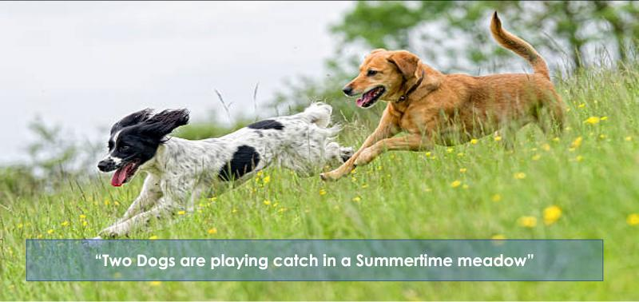

# Image-Caption-Generation

Pytorch implementation of an Image Caption Generator using a combination of CNN and RNN.

---

## Table of Contents
- [Overview](#overview)
- [Dataset](#dataset)
- [Requirements](#requirements)
- [Usage](#usage)
  - [Training](#training)
- [Model Architecture](#model-architecture)
- [Results](#results)
- [References](#references)

---

## Overview
This project implements an Image Caption Generation model using PyTorch. The model leverages a Convolutional Neural Network (CNN) for feature extraction from images and a Recurrent Neural Network (RNN) for generating captions based on the extracted features.

---

## Dataset
The dataset used in this project is the **Flickr8k** dataset, which contains 8,000 images and their corresponding captions.

- **Download the dataset from Kaggle:** [Flickr8k Dataset](https://www.kaggle.com/datasets/adityajn105/flickr8k)
- Extract the dataset into a folder, and ensure the file structure matches the following format:
  ```
  Flickr8k/
  |-- Images/
  |-- captions.txt
  ```

---

## Requirements
Install the required dependencies using the following command:

### Key Dependencies
- Python 3.7+
- PyTorch
- NumPy
- Matplotlib
- PIL (Pillow)
- NLTK

---

## Usage

### Training
1. Preprocess the dataset:
   ```bash
   python custum_dataset_loader.py
   ```

2. Run the training script:
   ```bash
   python train.py 
   ```

## Model Architecture

### Encoder (CNN)
The encoder is a pre-trained CNN (e.g., ResNet50) that extracts feature vectors from images.

### Decoder (RNN)
The decoder is an LSTM-based model that generates captions from the encoded image features.

### Key Components:
- **Attention Mechanism**: Helps the model focus on specific parts of the image during caption generation.
- **Embedding Layer**: Converts words into dense vector representations.

---

## Results
### Metrics
- **BLEU Scores**: Evaluated using BLEU-1, BLEU-2, BLEU-3, and BLEU-4.

### Sample Outputs
| **Image**         | **Generated Caption** |
|--------------------|-----------------------|
|  | "Two Dogs are Playing catch in summertime meadow" |

---

## References
- [Flickr8k Dataset](https://www.kaggle.com/datasets/adityajn105/flickr8k)
- [PyTorch Documentation](https://pytorch.org/docs/)

---

Feel free to contribute or report issues! If you have any questions, contact [your-email@example.com].
